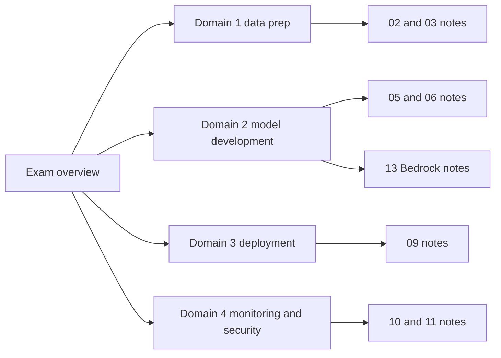

# MLA-C01 Exam Overview

## Knowledge Relevance

This is the top-level map for the AWS Certified Machine Learning Engineer - Associate exam.

## Current Exam Shape

| Domain | Weight | Local starting point |
| --- | ---: | --- |
| Domain 1: Data Preparation for Machine Learning | 28% | [[domain-1-data-preparation]] |
| Domain 2: ML Model Development | 26% | [[domain-2-model-development]] |
| Domain 3: Deployment and Orchestration of ML Workflows | 22% | [[domain-3-deployment-orchestration]] |
| Domain 4: ML Solution Monitoring, Maintenance, and Security | 24% | [[domain-4-monitoring-security]] |

## Study Flow

## Scope Rules

- Prefer the official exam guide and official AWS service docs over third-party summaries.
- Treat services in AWS full shutdown or sunset as lifecycle caveats even if a service appears in a static certification service list.
- Keep supplemental notes, but do not let them crowd out current in-scope services.

## Related Notes

- [[in-scope-services]]
- [[out-of-scope-services]]
- [[study-roadmap]]

## Sources

- https://docs.aws.amazon.com/aws-certification/latest/machine-learning-engineer-associate-01/machine-learning-engineer-associate-01.html
- https://docs.aws.amazon.com/aws-certification/latest/machine-learning-engineer-associate-01/mla-01-in-scope-services.html
- https://docs.aws.amazon.com/aws-certification/latest/machine-learning-engineer-associate-01/mla-01-out-of-scope-services.html
