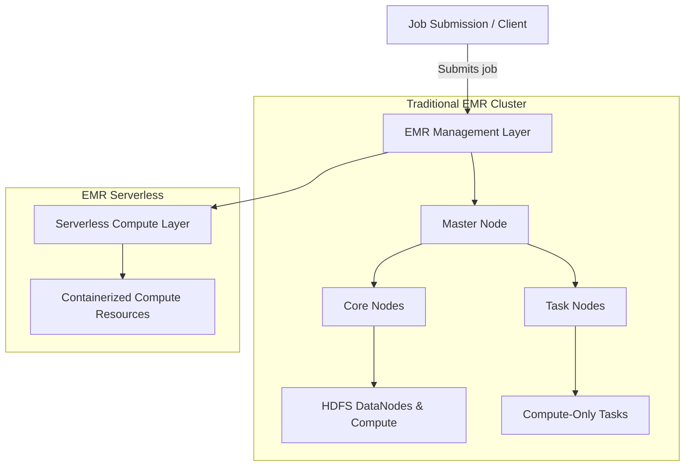

### 1. Detailed Overview

Amazon EMR is a managed **big data platform** designed to process vast amounts of data using open-source frameworks such as Apache Hadoop, Spark, HBase, Presto, and more. It is engineered for scalability, flexibility, and cost-effectiveness, making it an ideal solution for data-intensive applications and machine learning workflows.

**Relevance to AWS ML Services:**

- **Data Preprocessing & Feature Engineering:** Before deploying ML models, you often need to clean, aggregate, and transform large datasets. EMR’s capabilities for distributed computing let you efficiently perform these tasks across a cluster.
- **Integration with ML Ecosystem:** EMR seamlessly integrates with AWS data storage services like Amazon S3 and data catalogs like AWS Glue, which, together, form the backbone of data lakes used in ML projects. It also complements services such as Amazon SageMaker, where you can transfer preprocessed data for model training, hyperparameter tuning, and deployment.
- **Scalable and Cost-Effective Data Processing:** By leveraging spot instances and auto-scaling, EMR can reduce processing costs when handling large-scale batch jobs, a common scenario in training machine learning models on large datasets.

---

### 2. AWS Services and Features Pertinent to EMR

**Core Services and Features:**

- **Amazon EMR Clusters:**

  - **Managed Cluster Provisioning:** EMR automates cluster provisioning, configuration, and tuning, which reduces operational overhead.
  - **Support for Multiple Frameworks:** It supports Hadoop for batch processing, Apache Spark for in-memory processing and ML libraries (MLlib), Hive for SQL-based analytics, and more.

- **EMR Notebooks:**

  - **Interactive Development Environment:** Provides an interactive Jupyter-based notebook environment for exploring data and creating data processing pipelines in conjunction with Apache Spark, ideal for rapid prototyping in ML projects.

- **Cluster Scalability and Cost Management:**

  - **Auto Scaling:** Dynamically adjusts the number of nodes based on workload demands, optimizing cost without sacrificing performance.
  - **Spot Instances:** Leverage lower-cost spot instances to run non-critical or fault-tolerant batch jobs, reducing overall infrastructure costs.

- **Integration with Other AWS Services:**
  - **Amazon S3:** Serves as the primary data lake for storing raw, preprocessed, and output data.
  - **AWS Glue & Data Pipeline:** Assist in cataloging and moving data between data stores, complementing EMR’s processing capabilities.
  - **Amazon CloudWatch:** For monitoring cluster performance, logging, and setting alarms to ensure the health of ML workflows.

**Typical Use Cases:**

- **Data Ingestion & ETL:** Processing and transforming massive datasets that reside in data lakes before feeding them into ML algorithms.
- **Distributed Model Training:** Running distributed machine learning algorithms using Spark MLlib on EMR.
- **Real-Time Analytics Preparation:** Preprocessing streaming data in near-real time and integrating with services for predictive analytics.

---

### 3. Practical Examples and Scenarios

**Example 1: Data Preprocessing for Model Training**

- **Scenario:** A company collects terabytes of clickstream data stored in Amazon S3.
- **Implementation:** An EMR cluster running Apache Spark is configured to clean, aggregate, and transform this raw data into a structured format, such as a feature matrix. The processed data is then exported back to S3 and subsequently used to train a machine learning model in Amazon SageMaker.

**Example 2: Distributed Training with Spark MLlib**

- **Scenario:** An organization needs to build a predictive maintenance model using sensor data from IoT devices.
- **Implementation:** Using EMR’s support for Apache Spark, data scientists distribute the model training process over several nodes. Spark MLlib enables them to execute scalable machine learning algorithms efficiently, leveraging the cluster’s computational resources.

**Example 3: Batch Processing and Analytics**

- **Scenario:** An online retailer wants to analyze historical sales data to forecast demand.
- **Implementation:** EMR is used to run batch jobs that aggregate sales data and perform time-series analysis. The insights generated guide inventory management and marketing strategies, while intermediate results may inform further ML model enhancements.

---

### 4. Common Challenges and Best Practices

**Common Challenges:**

- **Cluster Sizing and Resource Management:**  
  Selecting the appropriate instance types and cluster size can be challenging. Over-provisioning leads to unnecessary costs while under-provisioning may hamper performance.

- **Cost Optimization:**  
  Balancing performance with cost, especially when using spot instances and managing auto-scaling policies in fluctuating workloads.

- **Data Security and Compliance:**  
  Ensuring data encryption in transit and at rest, along with proper IAM roles and network configurations to secure data and processing.

- **Performance Tuning:**  
  Achieving optimal performance requires fine-tuning the execution of distributed jobs, managing data skew, and leveraging caching effectively within Spark.

**Best Practices:**

- **Right-Size Clusters:**  
  Use AWS recommendations and monitoring (CloudWatch metrics) to adjust node types and counts dynamically. Employ auto-scaling to match processing needs in real-time.

- **Cost Management Strategies:**  
  Integrate spot instances where possible and leverage cost allocation tags for better tracking. Regularly review billing and usage reports.

- **Secure Configurations:**
  - **IAM and VPC Settings:** Configure least-privilege access policies and run clusters in a secure VPC environment.
  - **Encryption:** Use encryption for data stored in S3 and in transit between nodes.
- **Monitoring and Logging:**  
  Leverage CloudWatch for monitoring EMR cluster performance and set up logging to capture errors and performance metrics for troubleshooting.

- **Integration with Workflow Orchestration Tools:**  
  Consider using AWS Step Functions or Apache Airflow (with AWS Managed Workflows for Apache Airflow) to orchestrate EMR jobs in larger ML pipelines.

---

### 5. Additional Resources

To deepen your understanding of Amazon EMR and its role in ML workflows, consider the following resources:

- **AWS Official Documentation:**

  - [Amazon EMR Documentation](https://docs.aws.amazon.com/emr/latest/ManagementGuide/emr-what-is-emr.html) – Detailed guides on setup, configuration, and best practices. citeAWS_EMR_Docs

- **AWS Whitepapers and Best Practice Guides:**

  - “Best Practices for Running Apache Spark on AWS EMR” – Offers insights into performance tuning, cost management, and security considerations. citeAWS_Spark_on_EMR_Whitepaper

- **Tutorials and Workshops:**

  - AWS hands-on tutorials and webinars (accessible via the [AWS Machine Learning Blog](https://aws.amazon.com/blogs/machine-learning/)) often cover end-to-end ML workflows involving EMR. citeAWS_ML_Blog

- **AWS Training and Certification Materials:**
  - The exam guide and sample questions for the AWS Certified Machine Learning – Specialty and Associate exams provide insights into how EMR might be integrated into broader ML architectures. citeAWS_ExamGuide

---

### Conclusion

Amazon EMR is a powerful, flexible service that plays a critical role in data preprocessing, large-scale data processing, and distributed machine learning workflows. By leveraging its built-in scalability, integration with AWS data lakes (like S3), and support for frameworks like Spark, you can design efficient, cost-effective ML pipelines. Understanding its capabilities, associated challenges, and best practices is essential for tackling real-world ML scenarios and preparing for the AWS Certified Machine Learning Engineer – Associate exam.

This comprehensive exploration should provide you with the foundational insights and practical guidance necessary to effectively integrate EMR into your ML strategies and exam preparation.

## 1. Detailed Overview

### EMR Serverless

Amazon EMR Serverless is a deployment option for running big data applications without the need to provision or manage clusters explicitly. With serverless mode, you submit your jobs—typically Apache Spark or Apache Hive queries—and the service automatically provisions the underlying compute resources, scales them up and down dynamically based on workload, and then deallocates resources when the jobs finish. This model is especially attractive for intermittent workloads and helps optimize cost and operational overhead.

### Traditional EMR Node Architecture

In the traditional (cluster-based) EMR model, the architecture is composed of several node types:

- **Master Node:**  
  Acts as the control plane by managing cluster orchestration, scheduling tasks (via YARN in Hadoop-based clusters), and coordinating job execution. It runs essential services such as the HDFS NameNode and YARN ResourceManager.
- **Core Nodes:**  
  Serve as both compute and storage nodes. They perform data processing tasks and host the HDFS DataNodes, making them responsible for storing and replicating data.
- **Task Nodes:**  
  These are optional nodes added purely for scaling out compute capacity without contributing to the HDFS storage. They are ideal for handling compute-intensive jobs.

With EMR Serverless, the explicit notion of these nodes is abstracted away; you interact with a managed, containerized computing layer that automatically handles scaling and resource allocation.

### Apache Spark and Hadoop Overview

- **Apache Spark:**  
  An open-source, distributed computing engine renowned for its in-memory processing capabilities. In the context of EMR, Spark enables rapid iterative processing—ideal for machine learning algorithms and data transformations. It includes the MLlib library, which offers scalable machine learning algorithms and utilities, making it a frequent choice for training and inference pipelines.

- **Apache Hadoop:**  
  A framework designed for reliable, distributed storage (via HDFS) and batch processing using MapReduce. Although its batch-oriented nature has given way to more real-time systems like Spark, Hadoop remains essential for legacy jobs and workloads where massive data shuffling and distributed file storage are required.

---

## 2. AWS Services and Features

### EMR Serverless Features

- **Automatic Resource Management:**  
  No need to pre-provision or manually scale clusters. The serverless platform dynamically allocates containers based on the job’s requirements.
- **Pay-As-You-Go Pricing:**  
  Charges are incurred only for the compute resources consumed during job execution.
- **Simplified DevOps:**  
  Reduced operational overhead since AWS handles provisioning, scaling, and infrastructure maintenance.

### Traditional EMR Cluster Features

- **Node Diversity and Role Separation:**
  - **Master Node:** Provides orchestration and cluster management.
  - **Core Nodes:** Offer both compute and HDFS storage.
  - **Task Nodes:** Add extra compute capacity without storage overhead.
- **Framework Support:**  
  EMR clusters can run multiple big data frameworks (Spark, Hadoop MapReduce, Hive, Presto, etc.) within the same cluster.
- **Integration:**  
  Tight integration with Amazon S3 for storage, AWS Glue for metadata, and CloudWatch for logging and monitoring enhances the end-to-end data processing and machine learning workflow.

### Typical Use Cases

- **Preprocessing Large Data Sets:**  
  Use EMR Serverless or traditional clusters to transform and cleanse raw data stored in Amazon S3 before feeding it into Amazon SageMaker for model training.
- **Distributed ML Training:**  
  Execute distributed machine learning algorithms on large datasets using Spark’s MLlib in either a serverless environment or a provisioned cluster.
- **Batch and Stream Processing:**  
  Handle ETL pipelines where Hadoop MapReduce jobs run for batch processing and Spark streaming manages near-real-time processing.

---

## 3. Practical Examples and Scenarios

### Example 1: Data Preprocessing Using EMR Serverless

- **Scenario:**  
  A data science team needs to transform terabytes of sensor data stored in Amazon S3.
- **Implementation:**  
  They develop an Apache Spark job for data cleansing and aggregation. Rather than managing a persistent cluster, they submit the job to EMR Serverless. The service automatically scales container resources, processes the data, and writes the clean, aggregated output back to S3—all without upfront cluster management.

### Example 2: Distributed Model Training with Spark on a Traditional EMR Cluster

- **Scenario:**  
  An organization is building a predictive maintenance model using historical equipment sensor data.
- **Implementation:**  
  An EMR cluster is provisioned with a dedicated master node, several core nodes for both compute and storage, and additional task nodes for handling peak compute loads. Apache Spark with MLlib distributes the training process across nodes, enabling parallel processing of the data and faster model convergence.

### Example 3: Batch Processing Using Hadoop MapReduce

- **Scenario:**  
  A legacy system requires the execution of periodic batch jobs to process log files and update summarized metrics.
- **Implementation:**  
  A traditional EMR cluster runs Hadoop MapReduce jobs, storing intermediate results on HDFS across core nodes. Despite newer technologies being available, Hadoop MapReduce remains a reliable option for this type of batch processing workload.

---

## 4. Architecture and Mermaid Diagram

Below is a sample mermaid diagram that contrasts the architecture of a traditional EMR cluster (with different node types) and illustrates where EMR Serverless fits conceptually.

**Explanation of the Diagram:**

- **Job Submission / Client:**  
  This represents the user or application submitting jobs.
- **EMR Management Layer:**  
  In both traditional and serverless models, AWS EMR’s management layer receives the job submission and determines how to allocate resources.

- **Traditional EMR Cluster:**

  - **Master Node:** Manages orchestration and resource allocation.
  - **Core Nodes:** Run compute tasks and host HDFS DataNodes for storage.
  - **Task Nodes:** Provide additional compute capacity without persistent storage.

- **EMR Serverless:**
  - **Serverless Compute Layer:** Abstracts the infrastructure; you don’t see or manage individual nodes.
  - **Containerized Compute Resources:** These are automatically provisioned to run the job and are scaled dynamically.

---

## 5. Common Challenges and Best Practices

### Challenges

- **Resource Tuning in EMR Serverless:**  
  Determining optimal job configurations (e.g., concurrency, memory settings) for varying workloads can be challenging since the underlying infrastructure is abstracted.
- **Cluster Sizing in Traditional Deployments:**  
  Incorrectly sizing master, core, and task nodes may lead to performance bottlenecks or excessive costs.
- **Framework Tuning:**  
  Both Apache Spark and Hadoop jobs require tuning (e.g., memory allocation, number of executors, data partitioning) to handle diverse datasets effectively.
- **Security and Data Compliance:**  
  Ensuring data is securely stored and processed (using encryption, proper IAM roles, and network configurations) is crucial in any deployment model.

### Best Practices

- **For EMR Serverless:**

  - Start with smaller, iterative jobs to understand scaling behavior.
  - Monitor job metrics via CloudWatch and adjust parameters accordingly.
  - Use serverless for workloads with sporadic or unpredictable demand to optimize cost efficiency.

- **For Traditional Clusters:**

  - Right-size clusters by leveraging auto-scaling features, spot instances, and cost monitoring.
  - Separate workloads by allocating task nodes for compute-intensive jobs and core nodes for data storage.
  - Continuously monitor performance using CloudWatch and fine-tune job parameters.

- **Apache Spark and Hadoop Tuning:**
  - For Spark, focus on memory and executor configuration, data serialization, and caching strategies.
  - For Hadoop, consider data locality, task parallelism, and YARN resource management.

---

## 6. Additional Resources

To further solidify your understanding and prepare for the exam, consider these key resources:

- **AWS Documentation:**

  - [Amazon EMR Documentation](https://docs.aws.amazon.com/emr/latest/ManagementGuide/emr-what-is-emr.html) – Comprehensive guides on EMR features and best practices. citeAWS_EMR_Docs
  - [EMR Serverless Documentation](https://docs.aws.amazon.com/emr/latest/EMR-Serverless-UserGuide/) – Specific details on how to deploy and manage jobs with EMR Serverless. citeAWS_EMR_Serverless_Docs

- **Whitepapers and Blog Posts:**

  - “Best Practices for Running Apache Spark on AWS EMR” provides detailed tuning and cost-optimization recommendations. citeAWS_Spark_on_EMR_Whitepaper
  - AWS Machine Learning Blog posts frequently discuss integration patterns between EMR, Amazon SageMaker, and other data services. citeAWS_ML_Blog

- **Tutorials and Hands-On Labs:**
  - The AWS Workshops and tutorials on [AWS Training](https://aws.amazon.com/training/) offer practical, hands-on experience with both EMR Serverless and traditional EMR clusters.

---

## Conclusion

Understanding the distinctions between EMR Serverless and traditional EMR clusters—including the roles of various node types—is essential for designing scalable, efficient ML pipelines on AWS. Apache Spark’s in-memory processing and Hadoop’s batch processing capabilities continue to play pivotal roles in big data and ML workflows. By mastering these concepts, configuring resources appropriately, and following best practices, you'll be well-prepared to tackle practical ML scenarios and the AWS Certified Machine Learning Engineer – Associate exam.
