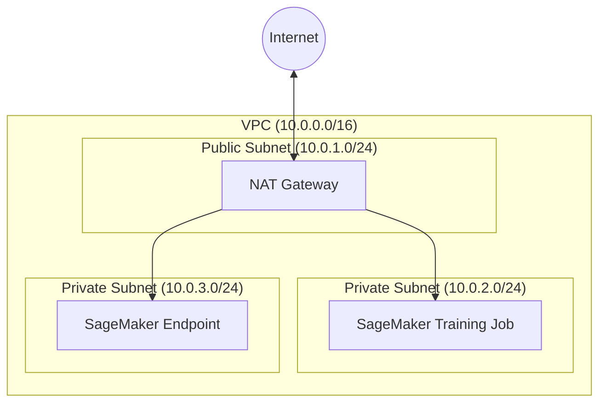
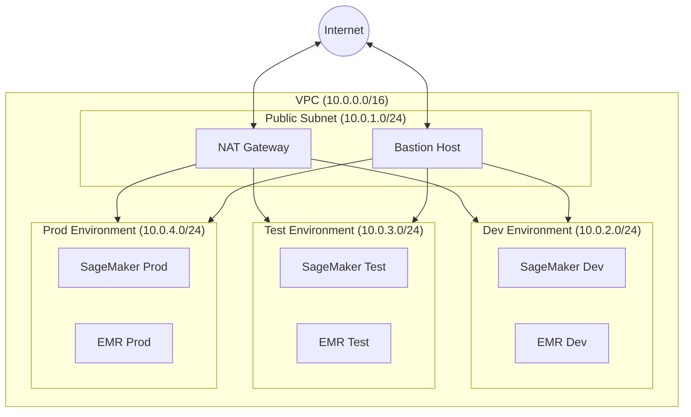
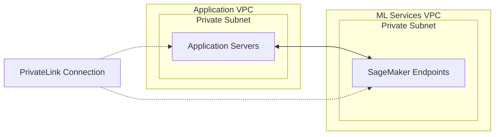

## ✅ 1. **Overview of AWS VPC**

**Amazon Virtual Private Cloud (VPC)** is a service that lets you launch AWS resources in a logically isolated virtual network. VPC provides complete control over your virtual networking environment, including resource placement, connectivity, and security.

### 🔍 Key Concepts

- **Virtual Private Cloud (VPC)**: A virtual network dedicated to your AWS account
- **Subnet**: A range of IP addresses in your VPC
- **Route Table**: Contains rules (routes) that determine where network traffic is directed
- **Internet Gateway**: Connects your VPC to the internet
- **NAT Gateway/Instance**: Enables instances in private subnets to connect to the internet
- **Security Group**: Acts as a virtual firewall for instances to control inbound and outbound traffic
- **Network ACL (NACL)**: Acts as a firewall for associated subnets to control inbound and outbound traffic
- **VPC Endpoint**: Enables private connectivity to services within AWS, without internet gateway
- **Elastic Network Interface (ENI)**: A virtual network interface that you can attach to an instance
- **PrivateLink**: Technology that provides private connectivity between VPCs, AWS services, and on-premises networks without exposing traffic to the public internet

---

## ✅ 2. **VPC Components & Features**

### 🌐 VPC and Subnet Basics

| Component          | Description                         | Limit                  | Notes                                              |
| ------------------ | ----------------------------------- | ---------------------- | -------------------------------------------------- |
| **VPC**            | Logical division of AWS cloud       | 5 per region (default) | Size between /16 and /28 CIDR block                |
| **Subnet**         | Segment of a VPC's IP address range | 200 per VPC            | Cannot overlap with other subnets                  |
| **Public Subnet**  | Has route to Internet Gateway       | N/A                    | Used for resources that need internet access       |
| **Private Subnet** | No direct route to Internet         | N/A                    | Used for resources that don't need internet access |

### 🔍 Default VPC vs Custom VPC

| Feature              | Default VPC                       | Custom VPC                               |
| -------------------- | --------------------------------- | ---------------------------------------- |
| **Creation**         | Automatically created             | Manually created                         |
| **CIDR Block**       | 172.31.0.0/16                     | User-defined                             |
| **Subnets**          | One public subnet per AZ          | User-defined                             |
| **Internet Gateway** | Yes (attached)                    | No (manual attachment)                   |
| **Security**         | Less secure                       | More secure (customizable)               |
| **Use Case**         | Quick testing, simple deployments | Production workloads, complex networking |

### 🚦 Routing and Internet Access

| Component                  | Purpose                                            | Key Features                                       |
| -------------------------- | -------------------------------------------------- | -------------------------------------------------- |
| **Route Table**            | Controls traffic routing                           | Every subnet must be associated with a route table |
| **Internet Gateway (IGW)** | Allows communication with internet                 | Horizontally scaled, redundant, highly available   |
| **NAT Gateway**            | Allows private subnet resources to access internet | Managed by AWS, highly available in AZ             |
| **NAT Instance**           | Similar to NAT Gateway but self-managed            | Cheaper but requires manual setup and maintenance  |
| **Egress-only IGW**        | Allows IPv6 outbound communication only            | Similar to NAT but for IPv6 traffic                |

### 🔒 Security Controls

| Feature            | Type                    | Scope                   | Stateful | Default Behavior                          |
| ------------------ | ----------------------- | ----------------------- | -------- | ----------------------------------------- |
| **Security Group** | Instance-level firewall | Applies to ENI/instance | Yes      | Deny all inbound, Allow all outbound      |
| **Network ACL**    | Subnet-level firewall   | Applies to subnet       | No       | Allow all inbound/outbound (default NACL) |
| **Flow Logs**      | Network traffic logging | VPC, subnet, or ENI     | N/A      | Not enabled by default                    |

### 🔌 VPC Connectivity Options

| Connection Type     | Use Case                           | Features                                           |
| ------------------- | ---------------------------------- | -------------------------------------------------- |
| **VPC Peering**     | Connect VPCs privately             | No transitive peering, 1:1 relationship            |
| **Transit Gateway** | Hub for multiple VPC connections   | Simplifies network architecture, regional          |
| **VPN Connection**  | Connect on-premises to AWS         | Encrypted IPsec connection over internet           |
| **Direct Connect**  | Dedicated private connection       | Higher bandwidth, lower latency, consistent        |
| **VPC Endpoint**    | Private connection to AWS services | Interface (powered by PrivateLink) or Gateway type |

---

## ✅ 3. **VPC and ML Workloads**

### 🧠 Why VPC Matters for ML

1. **Data Security**: Keep training data and model artifacts secure within private subnets
2. **Resource Isolation**: Separate ML environments (dev, test, prod) from other workloads
3. **Compliance**: Meet regulatory requirements for data handling and privacy
4. **Performance**: Optimize network performance for compute-intensive ML tasks
5. **Cost Optimization**: Control traffic patterns to reduce data transfer costs

### 📊 ML Services Integration with VPC

| ML Service           | VPC Integration                             | Key Considerations                                 |
| -------------------- | ------------------------------------------- | -------------------------------------------------- |
| **SageMaker**        | VPC mode for notebooks, training, inference | Needs S3 VPC Endpoint for data access              |
| **SageMaker Studio** | Can be VPC-only                             | Requires specific endpoints for full functionality |
| **Glue**             | Supports running in your VPC                | Needs NAT Gateway for internet-based sources       |
| **EMR**              | Launches in your VPC                        | Private subnet requires VPC endpoints              |
| **Redshift**         | Enhanced VPC routing                        | Keeps COPY/UNLOAD traffic in VPC                   |
| **Comprehend**       | VPC configuration for endpoints             | Requires ENIs in your VPC                          |
| **Rekognition**      | VPC endpoints for private access            | Controls who can access your vision ML services    |

---

## ✅ 4. **VPC Design Patterns for ML Workloads**

### 🏗️ Common Architecture Patterns

#### Pattern 1: Basic ML Infrastructure VPC



#### Pattern 2: Multi-Environment ML VPC



#### Pattern 3: VPC with Private Link Access to ML Services



---

## ✅ 5. **VPC Configurations for SageMaker**

### 🛠️ SageMaker VPC Access Modes

| Component              | VPC Options   | Requirements                                                |
| ---------------------- | ------------- | ----------------------------------------------------------- |
| **SageMaker Notebook** | VPC only mode | Internet access or VPC endpoints for AWS services           |
| **Training Job**       | VPC mode      | S3 VPC endpoint, ECR access, security group rules           |
| **Processing Job**     | VPC mode      | Similar to training job requirements                        |
| **Inference Endpoint** | VPC mode      | ENIs created in your VPC for private deployment             |
| **SageMaker Studio**   | VPC only mode | Needs specific endpoints for Git repos, SageMaker API, etc. |

### 📝 Example SageMaker Training in Private VPC

```python
# Define a training job with VPC configuration
training_params = {
    "AlgorithmSpecification": {
        "TrainingImage": "123456789012.dkr.ecr.us-west-2.amazonaws.com/my-ml-image:latest",
        "TrainingInputMode": "File"
    },
    "RoleArn": "arn:aws:iam::123456789012:role/SageMakerExecutionRole",
    "InputDataConfig": [...],
    "OutputDataConfig": {...},
    "ResourceConfig": {...},
    "VpcConfig": {
        "SecurityGroupIds": [
            "sg-0123456789abcdef0"
        ],
        "Subnets": [
            "subnet-0123456789abcdef0",
            "subnet-0123456789abcdef1"
        ]
    },
    "StoppingCondition": {...}
}

# Create the training job
sagemaker_client.create_training_job(**training_params)
```

---

## ✅ 6. **VPC Endpoints for ML Services**

### 🔌 Types of VPC Endpoints

| Type                   | Service Model     | Cost                          | Requirement                   |
| ---------------------- | ----------------- | ----------------------------- | ----------------------------- |
| **Gateway Endpoint**   | S3, DynamoDB      | Free                          | Route table entry             |
| **Interface Endpoint** | Most AWS services | Hourly rate + data processing | ENI in subnet, DNS resolution |

### 📊 Required Endpoints for ML Workloads

| Service        | Endpoint Type | Common Endpoints Needed                    |
| -------------- | ------------- | ------------------------------------------ |
| **SageMaker**  | Interface     | sagemaker.api, sagemaker.runtime, notebook |
| **S3**         | Gateway       | com.amazonaws.region.s3                    |
| **ECR**        | Interface     | ecr.api, ecr.dkr                           |
| **CloudWatch** | Interface     | monitoring, logs                           |
| **STS**        | Interface     | sts                                        |
| **KMS**        | Interface     | kms                                        |

### 📝 Example: Creating S3 Gateway Endpoint

```bash
aws ec2 create-vpc-endpoint \
    --vpc-id vpc-0123456789abcdef0 \
    --service-name com.amazonaws.us-east-1.s3 \
    --route-table-ids rtb-0123456789abcdef0
```

### 📝 Example: Creating SageMaker Interface Endpoint

```bash
aws ec2 create-vpc-endpoint \
    --vpc-id vpc-0123456789abcdef0 \
    --service-name com.amazonaws.us-east-1.sagemaker.api \
    --subnet-ids subnet-0123456789abcdef0 subnet-0123456789abcdef1 \
    --security-group-ids sg-0123456789abcdef0 \
    --private-dns-enabled
```

---

## ✅ 7. **Security Best Practices for ML in VPC**

### 🔒 Network Security

1. **Use Private Subnets** for ML workloads to avoid direct internet exposure
2. **Implement Security Groups** with least privilege principles:

   ```
   # Example Security Group for SageMaker Training
   Inbound:
   - Allow HTTPS (443) from VPC CIDR
   - Allow custom ML ports from specific security groups

   Outbound:
   - Allow HTTPS (443) to S3 VPC Endpoint
   - Allow custom ports needed for distributed training
   ```

3. **Apply Network ACLs** as an additional defense layer
4. **Enable VPC Flow Logs** to monitor and audit network traffic
5. **Use VPC Endpoints** to keep traffic within AWS network

### 🛡️ Data Protection

1. **Keep Data in Private Subnets** to prevent unauthorized access
2. **Encrypt Data in Transit** using TLS
3. **Protect S3 Buckets** with bucket policies restricting access to VPC endpoints:
   ```json
   {
     "Version": "2012-10-17",
     "Statement": [
       {
         "Effect": "Deny",
         "Principal": "*",
         "Action": "s3:*",
         "Resource": [
           "arn:aws:s3:::ml-training-bucket",
           "arn:aws:s3:::ml-training-bucket/*"
         ],
         "Condition": {
           "StringNotEquals": {
             "aws:sourceVpce": "vpce-0123456789abcdef0"
           }
         }
       }
     ]
   }
   ```

### 🔐 Access Control

1. **Use IAM Roles with VPC Conditions** to restrict service access to specific VPCs:
   ```json
   {
     "Version": "2012-10-17",
     "Statement": [
       {
         "Effect": "Allow",
         "Action": "sagemaker:CreateTrainingJob",
         "Resource": "*",
         "Condition": {
           "StringEquals": {
             "aws:SourceVpc": "vpc-0123456789abcdef0"
           }
         }
       }
     ]
   }
   ```
2. **Implement Bastion Hosts** for secure administrative access to VPC resources
3. **Set Up VPC Sharing** using AWS Resource Access Manager for multi-account ML environments

---

## ✅ 8. **Network ACL Rule Evaluation**

### 🧩 Understanding NACL Rule Processing

Network ACLs are stateless subnet-level firewalls that control traffic in and out of your VPC subnets. Understanding how they are evaluated is critical for effective security implementation.

### 🔢 Understanding CIDR Notation in NACLs

CIDR (Classless Inter-Domain Routing) notation is used to define IP address ranges in NACLs. The format is `IP_address/prefix_length` (e.g., 10.0.0.0/16).

#### CIDR Calculation Formula:

- Number of IP addresses = 2^(32 - prefix_length) for IPv4
- The prefix_length (the number after /) determines how many bits are fixed
- Lower prefix = Larger IP range (e.g., /16 is larger than /24)

#### Common CIDR Block Examples:

| CIDR Block     | Prefix | # of IPs | IP Range                | Common Use          |
| -------------- | ------ | -------- | ----------------------- | ------------------- |
| 10.0.0.0/16    | 16     | 65,536   | 10.0.0.0 - 10.0.255.255 | Entire VPC          |
| 10.0.0.0/24    | 24     | 256      | 10.0.0.0 - 10.0.0.255   | Typical subnet      |
| 10.0.0.0/28    | 28     | 16       | 10.0.0.0 - 10.0.0.15    | Small subnet        |
| 0.0.0.0/0      | 0      | All IPv4 | All possible IPs        | Open to all traffic |
| 192.168.1.0/32 | 32     | 1        | Just 192.168.1.0        | Single IP address   |

#### Example: Calculating Subnet Range for NACL Rules

For a NACL rule with CIDR block `172.16.50.0/24`:

1. **Determine the Subnet Mask**:

   - /24 means first 24 bits are fixed
   - Subnet mask in decimal = 255.255.255.0

2. **Calculate IP Range**:

   - First IP: 172.16.50.0 (network address)
   - Last IP: 172.16.50.255 (broadcast address)
   - Usable IPs: 172.16.50.1 to 172.16.50.254

3. **NACL Rule Application**:
   ```
   # NACL inbound rule allowing SSH access from this range
   Rule #: 100
   Protocol: TCP (6)
   Port Range: 22
   Source: 172.16.50.0/24
   Action: ALLOW
   ```
   This rule will allow SSH access from any IP in the range 172.16.50.0 - 172.16.50.255.

#### Example: Restricting Access to Specific ML Service IPs

To restrict access to a SageMaker endpoint from only specific IPs:

```
# Calculate the CIDR for corporate network 10.0.50.0 to 10.0.50.63
# This is 10.0.50.0/26 (26 fixed bits = 64 IPs)

# NACL rule:
Rule #: 110
Type: HTTPS
Protocol: TCP (6)
Port Range: 443
Source: 10.0.50.0/26
Action: ALLOW

# Default deny rule ensures other sources are blocked
Rule #: *
Type: All Traffic
Protocol: All
Port Range: All
Source: 0.0.0.0/0
Action: DENY
```

#### Tips for Working with CIDR Blocks in NACLs:

1. **Use CIDR calculators** for complex calculations
2. **Start restrictive** with higher prefix values (smaller IP ranges)
3. **Remember reserved addresses** (first and last IP in range)
4. **Plan your IP allocation carefully** to avoid overlapping ranges
5. **Prioritize rules** with more specific CIDR blocks (higher prefix)

### 📊 NACL Rule Evaluation Order

| Aspect                 | Details                                                             |
| ---------------------- | ------------------------------------------------------------------- |
| **Evaluation Process** | Rules are processed in order from lowest rule number to highest     |
| **Rule Priority**      | Lower rule numbers have higher priority                             |
| **First Match**        | The first matching rule is applied, others are ignored              |
| **Default Rule**       | Rule 32767 (asterisk rule) is the final catch-all rule              |
| **Ephemeral Ports**    | For responses, need outbound rules for ephemeral ports (1024-65535) |

### 📝 Example NACL Rules Evaluation

Consider this inbound NACL:

| Rule # | Type        | Protocol | Port Range | Source         | Allow/Deny |
| ------ | ----------- | -------- | ---------- | -------------- | ---------- |
| 100    | HTTP        | TCP      | 80         | 0.0.0.0/0      | ALLOW      |
| 110    | HTTPS       | TCP      | 443        | 192.168.1.0/24 | ALLOW      |
| 120    | SSH         | TCP      | 22         | 10.0.0.0/16    | ALLOW      |
| 200    | SSH         | TCP      | 22         | 0.0.0.0/0      | DENY       |
| \*     | ALL Traffic | ALL      | ALL        | 0.0.0.0/0      | DENY       |

For this configuration:

- HTTP traffic on port 80 from anywhere is allowed (Rule 100)
- HTTPS traffic on port 443 is only allowed from 192.168.1.0/24 (Rule 110)
- SSH traffic on port 22 is:
  - Allowed from 10.0.0.0/16 (Rule 120 matches first)
  - Denied from all other sources (Rule 200)
- All other traffic is denied by the default asterisk rule

### 🔍 NACL vs Security Groups

| Characteristic         | Network ACLs                                          | Security Groups                                 |
| ---------------------- | ----------------------------------------------------- | ----------------------------------------------- |
| **Stateful/Stateless** | Stateless - return traffic must be explicitly allowed | Stateful - return traffic automatically allowed |
| **Rule Evaluation**    | Evaluates rules in order, lowest number first         | All rules are evaluated before decision         |
| **Default Action**     | Default denies all traffic unless allowed             | Default allows all outbound, denies all inbound |
| **Rule Structure**     | Can have both allow and deny rules                    | Allow rules only                                |
| **Scope**              | Applied to entire subnet                              | Applied to individual resources (ENIs)          |

### ⚠️ Common NACL Mistakes

1. **Forgetting Ephemeral Ports**: Not allowing outbound traffic on ephemeral ports (1024-65535)
2. **Rule Ordering Issues**: Placing deny rules after allow rules with conflicting scope
3. **Overly Restrictive NACLs**: Creating NACLs that accidentally block legitimate traffic
4. **Scope Conflicts**: Creating rules with overlapping IP ranges but different actions

### 📝 Example: Configuring NACL for ML Workload

```bash
# Create NACL
aws ec2 create-network-acl --vpc-id vpc-0123456789abcdef0

# Add inbound rule to allow HTTPS from specific CIDR
aws ec2 create-network-acl-entry \
    --network-acl-id acl-0123456789abcdef0 \
    --ingress \
    --rule-number 100 \
    --protocol 6 \
    --port-range From=443,To=443 \
    --cidr-block 10.0.0.0/16 \
    --rule-action allow

# Add outbound rule for ephemeral ports (for return traffic)
aws ec2 create-network-acl-entry \
    --network-acl-id acl-0123456789abcdef0 \
    --egress \
    --rule-number 100 \
    --protocol 6 \
    --port-range From=1024,To=65535 \
    --cidr-block 0.0.0.0/0 \
    --rule-action allow
```

---

## ✅ 9. **Challenges & Troubleshooting VPC in ML**

### ⚠️ Common Challenges

| Challenge                         | Description                                     | Solution                                   |
| --------------------------------- | ----------------------------------------------- | ------------------------------------------ |
| **Internet Access**               | ML jobs need internet for external dependencies | Use NAT Gateway or required VPC endpoints  |
| **S3 Access**                     | Training jobs can't access S3 buckets           | Create S3 Gateway endpoint                 |
| **DNS Resolution**                | Interface endpoints not resolving               | Enable private DNS or configure custom DNS |
| **SageMaker Studio Connectivity** | Studio can't access resources                   | Configure required VPC endpoints           |
| **Cross-VPC ML Pipelines**        | Components in different VPCs can't communicate  | Use VPC peering or Transit Gateway         |
| **Security Group Rules**          | Overly restrictive rules block ML traffic       | Allow required ports between ML components |

### 🔍 Troubleshooting Steps

1. **Verify Network Path**

   ```bash
   # Test connectivity from instance in VPC
   ping <destination>  # Basic connectivity test
   traceroute <destination>  # Path analysis
   telnet <host> <port>  # Test specific port connectivity
   ```

2. **Check Security Groups**

   ```bash
   aws ec2 describe-security-groups --group-ids sg-0123456789abcdef0
   ```

3. **Examine Route Tables**

   ```bash
   aws ec2 describe-route-tables --route-table-ids rtb-0123456789abcdef0
   ```

4. **Analyze VPC Flow Logs**

   ```bash
   # Query flow logs with Athena
   SELECT * FROM vpc_flow_logs
   WHERE srcaddr = '10.0.1.5' AND dstaddr = '10.0.2.6'
   ```

5. **Test VPC Endpoint Access**
   ```bash
   # For S3 Gateway Endpoint
   aws s3 ls s3://my-bucket --region us-east-1 --endpoint-url https://s3.us-east-1.amazonaws.com
   ```

---

## ✅ 10. **Real-World Scenarios**

### 📊 Scenario 1: Secure ML Training Environment

**Requirement**: Create a secure environment for training ML models with sensitive healthcare data

**Solution**:

1. Create VPC with private subnets across multiple AZs
2. Set up required VPC endpoints (SageMaker API, runtime, S3, ECR)
3. Configure security groups to only allow necessary traffic
4. Enable VPC Flow Logs for auditing
5. Use SageMaker training with VPC configuration pointing to private subnets
6. Implement S3 bucket policy restricting access to VPC endpoint

### 📊 Scenario 2: Multi-Account ML Platform

**Requirement**: Build ML platform spanning development, testing, and production accounts

**Solution**:

1. Create separate VPCs in each account for isolation
2. Set up Transit Gateway for inter-VPC communication
3. Implement centralized egress through shared services account
4. Use Resource Access Manager to share subnets with ML accounts
5. Create consistent CIDR allocation plan across accounts
6. Define cross-account IAM roles with VPC-specific conditions

### 📊 Scenario 3: High-Performance ML Cluster

**Requirement**: Create infrastructure for distributed training with minimal latency

**Solution**:

1. Design VPC with cluster placement groups in private subnets
2. Configure Enhanced Networking on instances
3. Use Elastic Fabric Adapter for HPC workloads
4. Set up low-latency S3 transfer with VPC endpoints
5. Implement direct instance-to-instance communication via security groups
6. Monitor network performance with CloudWatch and VPC flow logs

---

## ✅ 10. **Additional Resources**

### 🔗 Official AWS Docs

- 📘 [Amazon VPC User Guide](https://docs.aws.amazon.com/vpc/latest/userguide/what-is-amazon-vpc.html)
- 📘 [SageMaker and VPC](https://docs.aws.amazon.com/sagemaker/latest/dg/vpc-interface-endpoints.html)
- 📘 [VPC Endpoints](https://docs.aws.amazon.com/vpc/latest/privatelink/vpc-endpoints.html)
- 📘 [Security Groups for Your VPC](https://docs.aws.amazon.com/vpc/latest/userguide/VPC_SecurityGroups.html)

### 📺 AWS Training Videos

- 🎓 [Amazon VPC Fundamentals](https://www.youtube.com/watch?v=fpxDGU2KdkA)
- 🎓 [Advanced VPC Design and New Capabilities](https://www.youtube.com/watch?v=tkaMmDQIZGw)
- 🎓 [SageMaker in a VPC](https://www.youtube.com/watch?v=iK8M1TyXpB4)

### 📝 Whitepapers

- 📄 [Building a Scalable and Secure Multi-VPC AWS Network Infrastructure](https://docs.aws.amazon.com/whitepapers/latest/building-scalable-secure-multi-vpc-network-infrastructure/welcome.html)
- 📄 [AWS Security Best Practices](https://docs.aws.amazon.com/whitepapers/latest/aws-security-best-practices/welcome.html)

### 🛠️ Labs and Workshops

- 🧪 [AWS Networking Workshop](https://networking.workshop.aws/)
- 🧪 [Amazon SageMaker Security Workshop](https://sagemaker-workshop.com/security.html)
