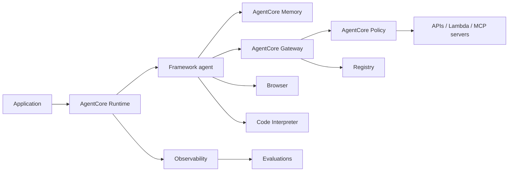

# Bedrock AgentCore Production Patterns

## Knowledge Relevance

Supplemental production-architecture note. Use for current Bedrock/agentic-AI implementation context, especially where deployment, orchestration, monitoring, maintenance, and security concepts overlap with MLA-C01 domains 3 and 4.

## When To Use

- Use AgentCore Runtime to deploy and scale custom agents built with frameworks such as Strands Agents, LangGraph, CrewAI, LlamaIndex, Google ADK, OpenAI Agents SDK, or custom code.
- Use AgentCore Gateway to expose APIs, Lambda functions, services, and MCP servers as governed agent tools.
- Use AgentCore Identity when tool calls need scoped access to AWS resources or third-party OAuth/API-key services.
- Use AgentCore Policy when tool access needs deterministic business-rule enforcement.
- Use AgentCore Observability and Evaluations when an agent needs production tracing, debugging, quality measurement, and regression monitoring.

## Core Concepts

- AgentCore is modular: Runtime, Memory, Gateway, Identity, Code Interpreter, Browser, Observability, Evaluations, Policy, and Registry can be combined or used independently.
- Runtime is for secure serverless hosting of custom agents and tools with session isolation.
- Memory supports short-term multi-turn context and long-term memory across sessions.
- Gateway converts tools and services into MCP-compatible endpoints and can connect to existing MCP servers.
- Browser and Code Interpreter add managed sandboxes for web interaction and code execution.
- Observability exposes traces and logs for debugging and audit.
- Evaluations provide structured quality signals for sessions, traces, and spans.
- Registry catalogs agents, MCP servers, tools, skills, and custom resources.

## AWS Services And Features

- Amazon Bedrock AgentCore Runtime
- Amazon Bedrock AgentCore Memory
- Amazon Bedrock AgentCore Gateway
- Amazon Bedrock AgentCore Identity
- Amazon Bedrock AgentCore Browser
- Amazon Bedrock AgentCore Code Interpreter
- Amazon Bedrock AgentCore Observability
- Amazon Bedrock AgentCore Evaluations
- Amazon Bedrock AgentCore Policy
- Amazon Bedrock AgentCore Registry
- Amazon CloudWatch

## Implementation Patterns

- Production agent runtime: deploy code package -> configure execution role -> run sessions with lifecycle limits -> emit OTEL-compatible traces/logs.
- Governed tool gateway: define tools from OpenAPI/Lambda/MCP -> attach identity/auth -> enforce policy before tool execution.
- Human-sensitive tool: model proposes action -> policy and app approval gate -> tool call -> audit log.
- Evaluation loop: collect sessions/traces/spans -> run task and behavioral evaluations -> compare regressions before promotion.

## Tradeoffs And Pitfalls

- AgentCore is not a replacement for Bedrock Agents; it is a production platform for custom agents and tool infrastructure.
- Browser and Code Interpreter tools expand capability but increase security, cost, and audit requirements.
- Gateway/MCP makes tools discoverable, so least privilege and policy boundaries become more important.
- Long-running agents require timeout, idempotency, retry, and cancellation design.
- Memory can improve personalization but must be scoped, explainable, and purgeable.
- Registry helps discover tools but also needs review/approval workflows to avoid unsafe tool sprawl.

## Decision Triggers

- "Custom open-source agent framework at production scale" points to AgentCore Runtime.
- "Convert APIs or Lambda into agent tools" points to AgentCore Gateway.
- "Tool call needs user-scoped OAuth access" points to AgentCore Identity.
- "Must prevent prohibited tool actions deterministically" points to AgentCore Policy.
- "Debug agent steps and evaluate quality over traces" points to AgentCore Observability and Evaluations.

## Related Notes

- [[bedrock-agentcore]]
- [[model-context-protocol-mcp]]
- [[strands-ai]]
- [[agent-squad]]
- [[bedrock-agents]]
- [[agentic-ai-current-innovation-map]]
- [[agentic-rag-patterns]]

## Sources

- https://docs.aws.amazon.com/bedrock-agentcore/latest/devguide/what-is-bedrock-agentcore.html
- https://docs.aws.amazon.com/bedrock-agentcore/latest/devguide/runtime-get-started-code-deploy.html
- https://docs.aws.amazon.com/bedrock-agentcore/latest/devguide/gateway.html
- https://docs.aws.amazon.com/bedrock-agentcore/latest/devguide/identity.html
- https://docs.aws.amazon.com/bedrock-agentcore/latest/devguide/memory.html
- https://docs.aws.amazon.com/bedrock-agentcore/latest/devguide/browser-using-tool.html
- https://docs.aws.amazon.com/bedrock-agentcore/latest/devguide/observability-configure.html
