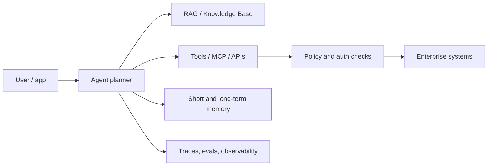

# Agentic AI Current Innovation Map

## Knowledge Relevance

Supplemental note for understanding current agentic AI direction around Bedrock, AgentCore, Claude, RAG, MCP, and production agent operations. Use this for architecture context, not as a primary MLA-C01 service checklist.

## When To Use

- Use managed [[bedrock-agents]] when you want Bedrock to orchestrate an agent with action groups, knowledge bases, traces, memory, and aliases.
- Use [[bedrock-agentcore]] when you need a production runtime, identity, memory, tool gateway, browser/code execution, policy controls, registry, observability, or evaluations for custom agents.
- Use [[model-context-protocol-mcp]] when agents need a standard way to discover and call external tools/data sources across clients.
- Use [[claude-agentic-ai-on-aws]] when choosing Claude models for reasoning-heavy, tool-using, long-context, or multimodal agent workflows.
- Use [[agentic-rag-patterns]] when retrieval is not just Q&A but part of a multi-step plan/tool loop.

## Core Concepts

- Agentic AI is moving from chatbot wrappers toward production systems with explicit runtime, memory, tool governance, and evaluation layers.
- RAG grounds agent responses, but agents add planning, tool calls, state, and action-taking.
- MCP standardizes tool/data interfaces; AgentCore Gateway can turn APIs, Lambda functions, services, and existing MCP servers into MCP-compatible tools.
- Claude models are strong candidates for reasoning, code, tool use, extended thinking, and long-context agent designs, with different feature availability on the Claude API, Claude Platform on AWS, and Amazon Bedrock.
- Production agents need controls beyond prompt engineering: identity, authorization, observability, policy, sandboxing, and regression evaluation.

## AWS Services And Features

- Amazon Bedrock
- Agents for Amazon Bedrock
- Amazon Bedrock Knowledge Bases
- Amazon Bedrock AgentCore Runtime, Memory, Gateway, Identity, Browser, Code Interpreter, Observability, Evaluations, Policy, and Registry
- Amazon CloudWatch and OTEL-compatible observability through AgentCore telemetry paths
- Anthropic Claude models through Amazon Bedrock and Claude Platform on AWS

## Implementation Patterns

- Managed Bedrock path: user -> Bedrock Agent alias -> supervisor/collaborator agent -> action groups and knowledge bases -> trace/evaluate.
- AgentCore path: app -> AgentCore Runtime -> framework agent such as Strands/LangGraph/custom -> AgentCore Gateway/MCP tools -> AgentCore Identity/Policy -> AgentCore Observability/Evaluations.
- Claude path: app -> Claude model -> tool use / MCP connector / extended thinking -> tool results -> final response, with feature availability checked per platform.

## Tradeoffs And Pitfalls

- Latest agentic capabilities may be supplemental to MLA-C01 even when they are important for real systems.
- Managed agents reduce infrastructure work but constrain orchestration shape.
- Custom agents increase control but require explicit runtime, auth, tracing, evals, cost controls, and timeout handling.
- MCP improves interoperability but does not remove the need for tool permissions, schema discipline, authentication, audit, and human approval for risky actions.
- Claude feature availability differs by platform; the Claude API, Claude Platform on AWS, Amazon Bedrock, Vertex AI, and Microsoft Foundry do not expose every feature identically.

## Decision Triggers

- "Private data Q&A" usually points to RAG or Knowledge Bases, not necessarily a full agent.
- "Call business APIs, take actions, and coordinate steps" points to agents/action groups/tools.
- "Run a custom open-source agent securely at scale" points to AgentCore Runtime.
- "Standardize tool access across multiple clients/agents" points to MCP or AgentCore Gateway.
- "Reasoning-heavy tool loop with Claude" points to Claude tool use and possibly extended thinking.

## Related Notes

- [[bedrock-agentcore]]
- [[bedrock-agentcore-production-patterns]]
- [[bedrock-agents]]
- [[bedrock-multi-agent-collaboration]]
- [[bedrock-rag-decision-guide]]
- [[model-context-protocol-mcp]]
- [[claude-agentic-ai-on-aws]]
- [[agentic-rag-patterns]]
- [[strands-ai]]
- [[agent-squad]]

## Sources

- https://docs.aws.amazon.com/bedrock-agentcore/latest/devguide/what-is-bedrock-agentcore.html
- https://docs.aws.amazon.com/bedrock/latest/userguide/agents.html
- https://docs.aws.amazon.com/bedrock/latest/userguide/agents-multi-agent-collaboration.html
- https://docs.aws.amazon.com/bedrock/latest/userguide/knowledge-base.html
- https://platform.claude.com/docs/en/about-claude/models/overview
- https://modelcontextprotocol.io/docs/learn/architecture
