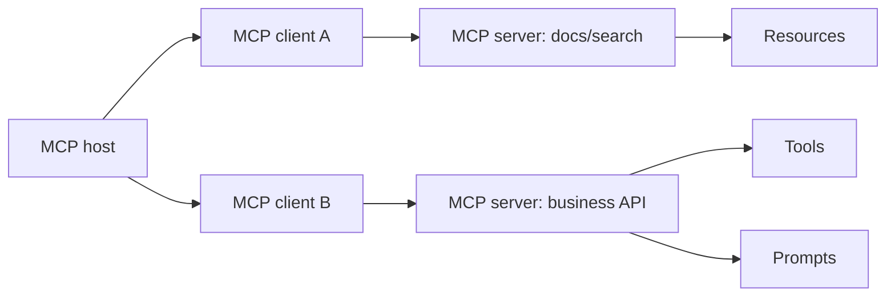

# Model Context Protocol (MCP)

## Knowledge Relevance

Supplemental current-agentic-AI note. MCP is not a primary MLA-C01 service, but it is increasingly important for understanding how agents connect to tools, data sources, prompts, and enterprise systems.

## When To Use

- Use MCP when multiple agents or clients need a common contract for external tools and contextual data.
- Use an MCP server when you want to expose tools, resources, or prompts behind a standard JSON-RPC protocol.
- Use AgentCore Gateway when you want AWS-managed conversion of APIs, Lambda functions, existing services, or MCP servers into governed MCP-compatible tools.
- Use direct provider tool calling when you only need a small number of model-specific functions and do not need cross-client interoperability.

## Core Concepts

- MCP has three main participants:
  - Host: AI application such as Claude Desktop, Claude Code, or an IDE.
  - Client: per-server connection manager created by the host.
  - Server: program that exposes tools, resources, prompts, and other context.
- Tools are model-controlled operations that can perform actions or side effects.
- Resources are application-driven context objects, such as files, database schemas, or app-specific records.
- Prompts are user-controlled reusable prompt templates exposed by servers.
- The protocol data layer uses JSON-RPC messages.
- Standard transports include local `stdio` and remote Streamable HTTP.

## AWS Services And Features

- Amazon Bedrock AgentCore Gateway: converts APIs, Lambda functions, and services into MCP-compatible tools and connects to existing MCP servers.
- Amazon Bedrock AgentCore Runtime: can host agents using protocols such as MCP and A2A.
- Anthropic Claude API MCP connector: connects Claude directly to remote MCP servers from the Messages API.

## Implementation Patterns

- Local developer integration: Claude Code or IDE host -> stdio MCP server -> local filesystem, docs, build tools.
- Enterprise remote integration: agent platform -> Streamable HTTP MCP endpoint -> OAuth/authz -> SaaS/API/data system.
- AWS managed tool gateway: agent -> AgentCore Gateway endpoint -> API/Lambda/OpenAPI/MCP target -> enterprise system.

## Tradeoffs And Pitfalls

- MCP standardizes the interface, not the business permission model.
- Tool schemas must be narrow, explicit, and testable; broad "do anything" tools raise blast radius.
- Human approval is important for destructive or externally visible tool calls.
- Remote MCP servers need authentication, origin validation, transport security, and audit logging.
- Claude API's MCP connector supports remote HTTP MCP servers, but direct connector availability differs by platform; it is not the same as Bedrock model invocation.
- Local `stdio` MCP servers are convenient for developer tools but need strict trust boundaries because they run local processes.

## Decision Triggers

- "Standard way for agents to access external tools/data" points to MCP.
- "Expose enterprise APIs as agent tools on AWS" points to AgentCore Gateway.
- "Read-only data context" points to MCP resources.
- "Action or side effect" points to MCP tools.
- "Reusable workflow instruction" points to MCP prompts or Claude Skills, depending on the platform.

## Related Notes

- [[agentic-ai-current-innovation-map]]
- [[bedrock-agentcore]]
- [[bedrock-agentcore-production-patterns]]
- [[claude-agentic-ai-on-aws]]
- [[agentic-rag-patterns]]

## Sources

- https://modelcontextprotocol.io/docs/learn/architecture
- https://modelcontextprotocol.io/specification/2025-06-18/server/tools
- https://modelcontextprotocol.io/specification/2025-06-18/server/resources
- https://modelcontextprotocol.io/specification/2025-06-18/server/prompts
- https://modelcontextprotocol.io/specification/2025-06-18/basic/transports
- https://docs.aws.amazon.com/bedrock-agentcore/latest/devguide/what-is-bedrock-agentcore.html
- https://platform.claude.com/docs/en/agents-and-tools/mcp-connector
